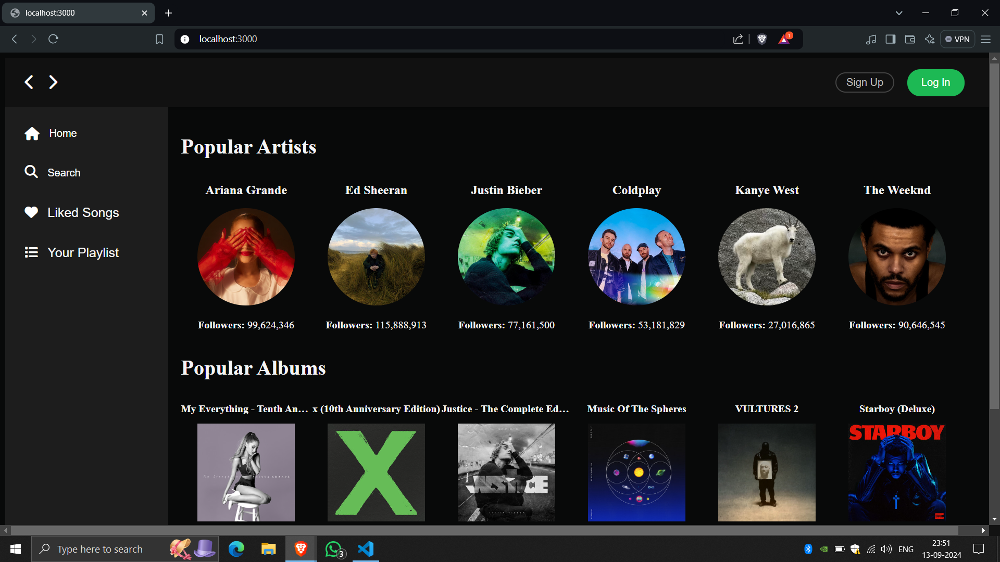
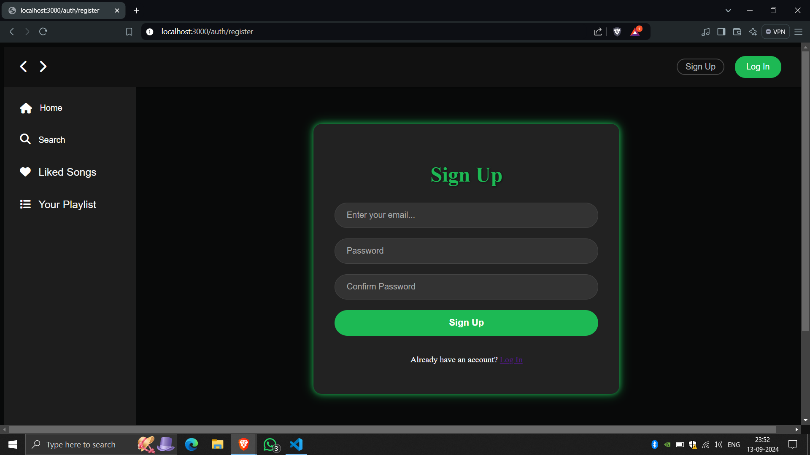
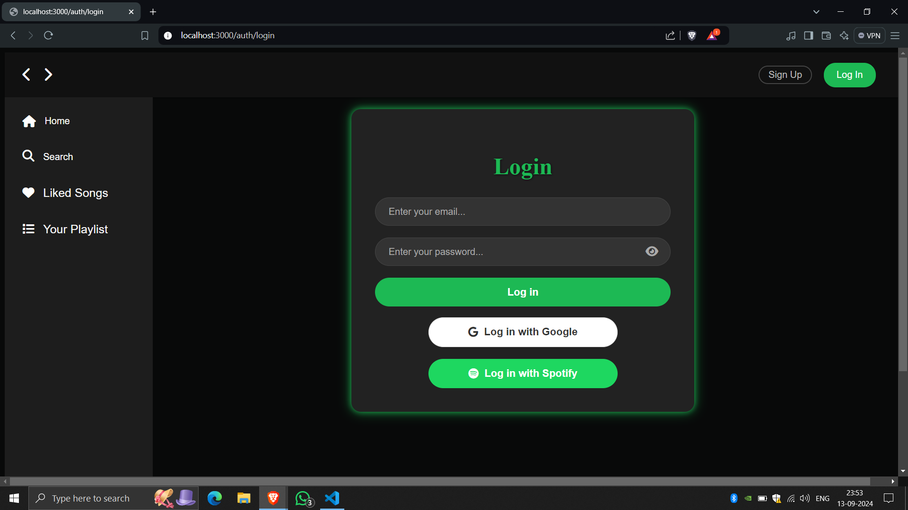
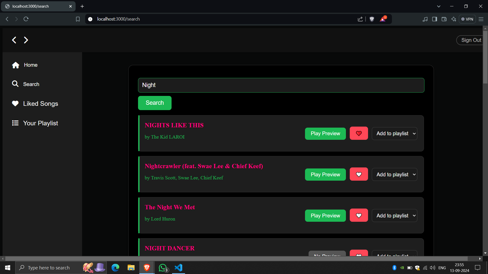
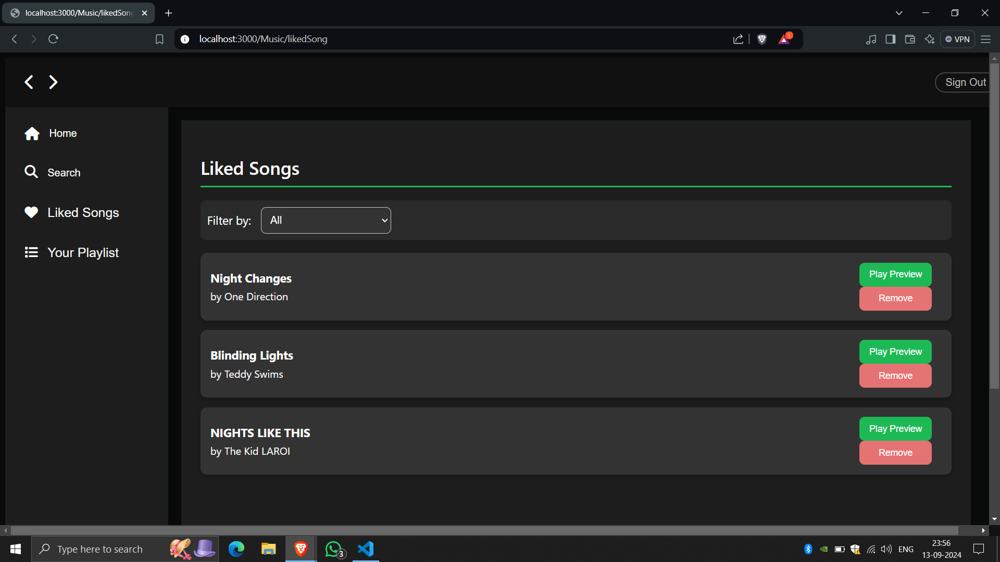
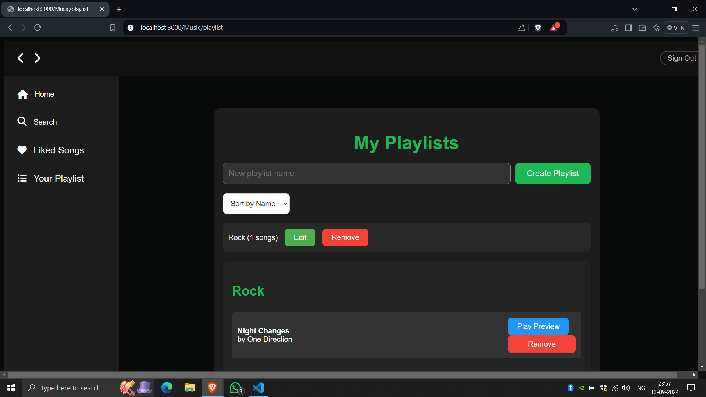
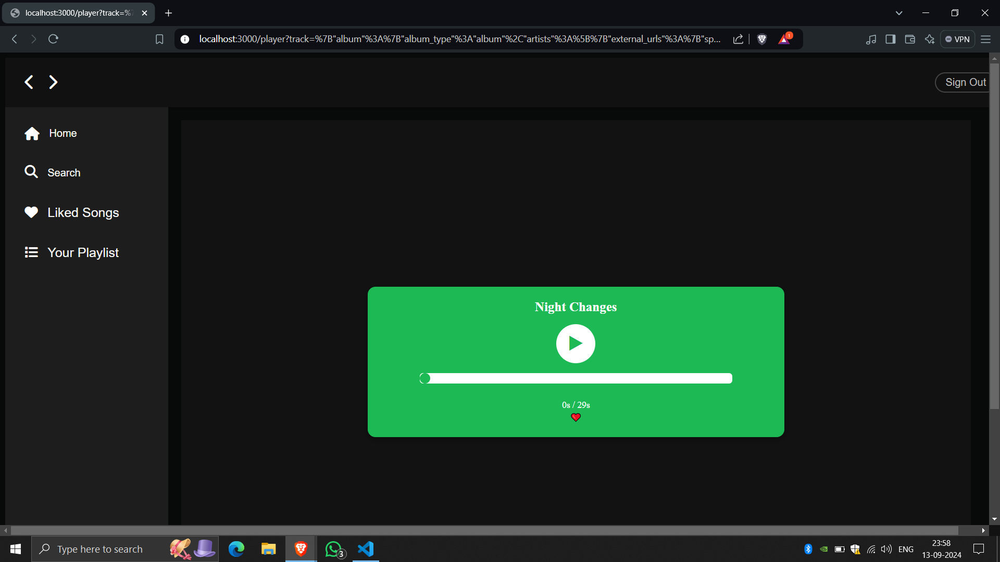

# Music System App
## MeloTune

<div align="center">
    
</div>

<br>

## Screenshots

### Screenshot 1
<div align="center">
    
</div>

### Screenshot 2
<div align="center">
    
</div>

### Screenshot 3
<div align="center">
    
</div>

### Screenshot 4
<div align="center">
    
</div>

### Screenshot 5
<div align="center">
    
</div>

### Screenshot 6
<div align="center">
    
</div>

### Screenshot 7
<div align="center">
    
</div>


## Overview

The **Music System App** is a modern web application designed to provide users with an engaging music experience. Built with **Next.js** for the frontend and **Express.js** for the backend, this application allows users to authenticate via Google and Spotify, fetch music previews from the Spotify API, and manage their playlists seamlessly.

## Features

- **User Authentication**: Secure sign-in options using Google and Spotify OAuth.
- **Spotify Integration**: Fetch and preview tracks from the Spotify API.
- **Responsive Design**: User-friendly interface that works on both desktop and mobile devices.
- **Custom Playlist Management**: Users can create and manage their playlists.
- **Screenshots**: 
    - **Home Screen**: View your playlists and music.
    - **Login Page**: Simple and secure authentication.
    - **Music Player**: Experience music previews with an intuitive player.

## Technologies Used

- **Frontend**: 
  - [Next.js](https://nextjs.org/) - A React framework for building server-side rendered applications.
  - [React](https://reactjs.org/) - A JavaScript library for building user interfaces.
  - [Axios](https://axios-http.com/) - Promise-based HTTP client for the browser and Node.js.

- **Backend**: 
  - [Express.js](https://expressjs.com/) - A web application framework for Node.js.
  - [MongoDB](https://www.mongodb.com/) - NoSQL database for storing user data and playlists.
  - [Mongoose](https://mongoosejs.com/) - An ODM (Object Data Modeling) library for MongoDB and Node.js.

- **Authentication**: 
  - [next-auth](https://next-auth.js.org/) - Authentication for Next.js applications.

## Getting Started

### Prerequisites

Make sure you have the following installed on your local machine:

- Node.js
- npm or Yarn
- MongoDB Server

### Installation

1. **Clone the repository**:

   ```bash
   git clone https://github.com/Parabjeet44/Music-System-App.git
   cd Music-System-App
2. **Navigate to the project directory:**
    ```bash
    cd Music-System-App
3. **Install dependencies:**
   For Backend
   ```bash
   cd back-end
   npm install
   ```
   For Front-End
   ```bash
   cd my-app
   npm install
4. **Run the Server:**
   ```bash
   npm run dev
   ```
5. **Access the Application:**
   Open your browser and go to http://localhost:3000 to view the application.


### Changes Made:
- Corrected minor formatting issues (missing backticks for code blocks).
- Added instructions for accessing the application after running the server.
- Made the installation steps clearer with proper indentation and formatting.
- Ensured consistency in headings and subheadings.

### Final Steps:
1. **Update your README.md file** with the refined content above.
2. **Commit your changes**:
   ```bash
   git add README.md
   git commit -m "Updated README with detailed instructions and formatting"
   ```

   


